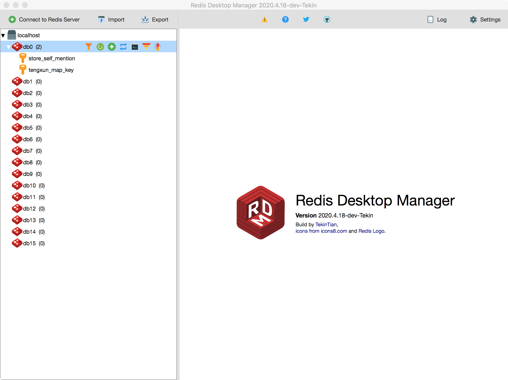

# [Redis Desktop Manager](http://redisdesktop.com "Redis Desktop Manager Offical Site")

[Install & Run](http://docs.redisdesktop.com/en/latest/install/) | 
[Quick Start](http://docs.redisdesktop.com/en/latest/quick-start/) |
[Native Formatters](http://docs.redisdesktop.com/en/latest/native-formatters/) |
[Development Guide](http://docs.redisdesktop.com/en/latest/development/) |
[Known issues](http://docs.redisdesktop.com/en/latest/known-issues/) |
[**Telegram Chat**](https://t.me/RedisDesktopManager)

http://docs.redisdesktop.com/en/latest/?badge=latest

Open source cross-platform Redis Desktop Manager based on Qt 5

### Build on OS X

1. Install [Xcode](https://developer.apple.com/xcode/) with Xcode build tools.

2. Install [Homebrew](http://brew.sh/).

3. Copy

    `cd ./src && cp ./resources/Info.plist.sample ./resources/Info.plist`

4. Building RDM dependencies require i.a. `openssl`, `cmake` and `python3`. Install them: 

   `brew install openssl cmake python3`

5. Install Python requirements

    `pip3 install -t ../bin/osx/release -r py/requirements.txt`

6. Install [Qt 5.9](<https://mirrors.tuna.tsinghua.edu.cn/qt/official_releases/qt/>). Add Qt Creator and under Qt 5.9.x add Qt Charts module.

7. Open `./src/rdm.pro` in **Qt Creator**.

8. Run build.

最新版QT CN下载加速镜像地址

<https://mirrors.tuna.tsinghua.edu.cn/qt/official_releases/qt/>

